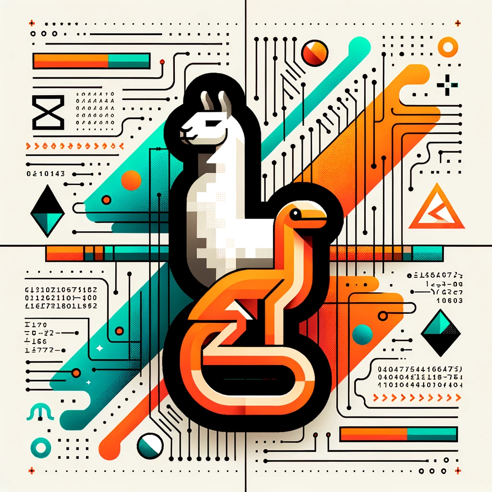

# llama2.zig

> Inference Llama 2 in pure Zig



This project is a port of Andrej Karpathy's [llama2.c](https://github.com/karpathy/llama2.c) into Zig, aimed at enhancing understanding of transformer models through clean, well-structured code. Utilizing a multi-file approach and descriptive variable names, it relies exclusively on the Zig standard library, without the need for external dependencies.

## Usage

Build and run `llama2-generator`:

```sh
zig build -Doptimize=ReleaseFast
./zig-out/bin/llama2-generator models/tinystories_15m --temperature 0 --verbose
```

The output on an Apple M1 Pro with 32 GB of memory:

```
Once upon a time, there was a little girl named Lily. She loved to play outside in the sunshine. One day, she saw a big, red ball in the sky. It was the sun! She thought it was so pretty.
Lily wanted to play with the ball, but it was too high up in the sky. She tried to jump and reach it, but she couldn't. Then, she had an idea. She would use a stick to knock the ball down.
Lily found a stick and tried to hit the ball. But the stick was too short. She tried again and again, but she couldn't reach it. She felt sad.
Suddenly, a kind man came by and saw Lily. He asked her what was wrong. Lily told him about the ball. The man smiled and said, "I have a useful idea!" He took out a long stick and used it to knock the ball down. Lily was so happy! She thanked the man and they played together in the sunshine.

achieved: 719.870 tok/s
```

## Run Llama 2 7B from Hugging Face

Install `git-lfs` and clone the [Llama 2 7B](https://huggingface.co/meta-llama/Llama-2-7b-hf) model from Hugging Face:

```sh
# Make sure you have git-lfs installed (https://git-lfs.com)
git lfs install
git clone https://huggingface.co/meta-llama/Llama-2-7b-hf
```

Install the necessary Python packages and convert the Hugging Face model:

```sh
pip3 install -r requirements.txt
python3 convert_hf_model.py /path/to/Llama-2-7b-hf models/llama2_7b_hf
```

Build and run `llama2-generator`:

```sh
zig build -Doptimize=ReleaseFast
./zig-out/bin/llama2-generator models/llama2_7b_hf --temperature 0 --sequence_length 28 --prompt "Once Upon a Time" --verbose
```

The output on an Apple M1 Pro with 32 GB of memory:

```
Once Upon a Time in Hollywood is a 2019 American comedy-drama film written and directed by Quentin Tarantino

achieved: 1.800 tok/s
```

## Run Llama 2 7B Chat from Hugging Face

Install `git-lfs` and clone the [Llama 2 7B Chat](https://huggingface.co/meta-llama/Llama-2-7b-chat-hf) model from Hugging Face:

```sh
# Make sure you have git-lfs installed (https://git-lfs.com)
git lfs install
git clone https://huggingface.co/meta-llama/Llama-2-7b-chat-hf
```

Install the necessary Python packages and convert the Hugging Face model:

```sh
pip3 install -r requirements.txt
python3 convert_hf_model.py /path/to/Llama-2-7b-chat-hf models/llama2_7b_chat_hf
```

Build and run `llama2-chat`:

```sh
zig build -Doptimize=ReleaseFast
./zig-out/bin/llama2-chat models/llama2_7b_chat_hf
```

The output on an Apple M1 Pro with 32 GB of memory:

```
Enter system prompt (optional):
User: Hello
Assistant: Hello! It's nice to meet you. Is there something I can help you with or would you like to chat?
User: ...
```

## Help

### llama2-generator

```
Usage: llama2-generator <model_path> [options]

Options:
  --temperature     <float>  = 1.0
  --top_p           <float>  = 0.9
  --random_seed     <int>    = <milli_timestamp>
  --sequence_length <int>    = <max_sequence_length>
  --prompt          <string> = ""
  --verbose
  --help
```

### llama2-chat

```
Usage: llama2-chat <model_path> [options]

Options:
  --temperature     <float>  = 1.0
  --top_p           <float>  = 0.9
  --random_seed     <int>    = <milli_timestamp>
  --sequence_length <int>    = <max_sequence_length>
  --system_prompt   <string> = ""
  --user_prompt     <string> = ""
  --help
```

## Papers

- Standard transformer architecture: [Attention Is All You Need](https://arxiv.org/abs/1706.03762)
- Llama 1: [LLaMA: Open and Efficient Foundation Language Models](https://arxiv.org/abs/2302.13971)
- Llama 2: [Llama 2: Open Foundation and Fine-Tuned Chat Models](https://arxiv.org/abs/2307.09288)
- Pre-normalization using RMSNorm: [Root Mean Square Layer Normalization](https://arxiv.org/abs/1910.07467)
- SwiGLU activation function: [GLU Variants Improve Transformer](https://arxiv.org/abs/2002.05202)
- Swish activation function: [Searching for Activation Functions](https://arxiv.org/abs/1710.05941)
- Rotary positional embeddings: [RoFormer: Enhanced Transformer with Rotary Position Embedding](https://arxiv.org/abs/2104.09864)
- Grouped-query attention: [GQA: Training Generalized Multi-Query Transformer Models from Multi-Head Checkpoints](https://arxiv.org/abs/2305.13245v1)
- Nucleus sampling: [The Curious Case of Neural Text Degeneration](https://arxiv.org/abs/1904.09751)
